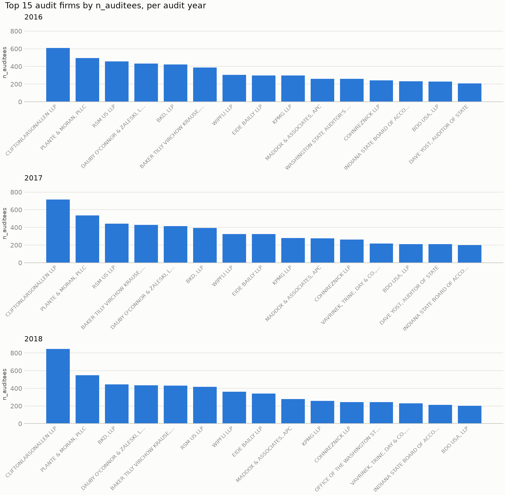

# Which audit firms serve the most auditees?

Federal Audit Clearinghouse single-audit submissions, audit years 2016–2018.

## Question

How many distinct auditees did each audit firm serve in each audit year, and
how does that distribution look year over year? Concretely: aggregate the
`general` extract to the (`auditor_firm_name`, `audit_year`) grain, count
auditees per group, and plot the leading firms as one panel per year with bars
ranked largest to smallest.

## Approach

| Step | What happened |
|---|---|
| Extract | `general.csv` (412,091 rows, 2016–2026) filtered to audit years 2016–2018 → **110,948 rows × 64 columns** |
| Load | `src/load.py` reads seven identifier columns as text, so ZIP and agency codes keep their leading zeros |
| Validate | `src/validate.py` gates the pipeline with a pandera schema built from the [FAC data dictionary](https://www.fac.gov/data/download/current-dictionary/) and from what exploration found; nothing downstream runs if it fails |
| Clean | Yes/No and t/f → nullable booleans, eight date columns parsed, the documented `GSA_MIGRATION` sentinel → NA, five information-free columns dropped |
| Aggregate | `src/aggregate.py` groups to **22,478 firm-years** and counts distinct auditees |
| Chart | `src/charts.py` draws the top 15 firms per year, one panel per year, shared y-scale |

The auditee identifier is **`auditee_ein`, not `auditee_uei`** — see Caveats.

## Results

Distinct auditees served, top five firms per year:

| Rank | 2016 | | 2017 | | 2018 | |
|---|---|---|---|---|---|---|
| 1 | CliftonLarsonAllen | **608** | CliftonLarsonAllen | **716** | CliftonLarsonAllen | **846** |
| 2 | Plante & Moran | 496 | Plante & Moran | 535 | Plante & Moran | 547 |
| 3 | RSM US | 455 | RSM US | 442 | BKD | 443 |
| 4 | Dauby O'Connor & Zaleski | 433 | Baker Tilly Virchow Krause | 430 | Dauby O'Connor & Zaleski | 435 |
| 5 | BKD | 422 | Dauby O'Connor & Zaleski | 415 | Baker Tilly Virchow Krause | 429 |



Three things stand out:

**CliftonLarsonAllen is pulling away.** It leads every year and grows 39% over
the period (608 → 716 → 846), while second-place Plante & Moran grows 10%. The
gap between first and second widens from 112 auditees to 299.

**The market is not concentrated at the top.** The 15 largest firms account for
only **13.9% / 14.3% / 14.9%** of auditee-engagements in 2016 / 2017 / 2018.
Concentration is rising, but slowly.

**The tail is enormous.** Around 7,400–7,700 firms file in any given year, and
**roughly 54–55% of them serve exactly one auditee**. This is a market of a few
national firms and several thousand sole engagements.

## Caveats

**`auditee_uei` cannot answer the question as originally posed.** The task named
UEI as the auditee identifier, but in this extract it is the documented
`GSA_MIGRATION` placeholder on 99.97% of rows. A distinct count over it returns
1 for 22,471 of 22,478 firm-years, with a maximum of 2 anywhere. I substituted
`auditee_ein`, which reaches 846. This is the single largest assumption in the
analysis. UEI was only populated for records submitted through the newer GSAFAC
system; 2016–2018 filings are predominantly legacy Census migrations.

**EIN is not a perfect entity key either.** CliftonLarsonAllen's 2018 group has
853 submissions, 853 distinct auditee *names*, but only **846 distinct EINs** —
so a handful of auditees share an EIN or file under related entities. Counts are
therefore approximate to within roughly 1%.

**Panels are ranked independently, so they are not traceable.** Each panel shows
its own top 15, so a firm can appear in one panel and not another without having
stopped filing. The figure answers "who was largest that year", not "how did
firm X move". Third place changes hands in 2018 partly for this reason.

**Firm names are not normalised.** Grouping is on the raw `auditor_firm_name`
string. Spelling variants, punctuation differences, and mergers are not
reconciled — Baker Tilly Virchow Krause and BKD both later merged into other
entities, which a longer time series would need to handle.

**The extract is a 26.9% slice.** Only audit years 2016–2018 of 2016–2026 were
loaded, chosen to keep the file manageable. Nothing here generalises to later
years, and the schema's `audit_year` bound (2016–2018) will reject a wider load
by design.

**Two cleaning defaults are judgment calls, not facts.** `sentinels_as_na=True`
treats `GSA_MIGRATION` as missing, which is defensible but semantic — the
dictionary calls it a legitimate value. And the drop of information-free columns
is *sample-dependent*: a column constant within a slice is discarded even if it
varies in the full data. Neither affects the counts above (verified: the
aggregation returns identical figures with and without cleaning), but both would
matter for other questions.

**"Auditees served" counts submissions, not revenue or hours.** A firm auditing
846 small non-profits and one auditing 50 large states are not comparable on
this measure. `total_amount_expended` would give a very different ranking.

## Reproducing

```powershell
uv run --with nbclient jupyter execute notebooks/02-explore.ipynb
```

Or open `notebooks/02-explore.ipynb` and Run All. The source file
`data/general_2016_2018.csv` is gitignored — rebuild it by filtering
`general.csv` to audit years 2016–2018.
